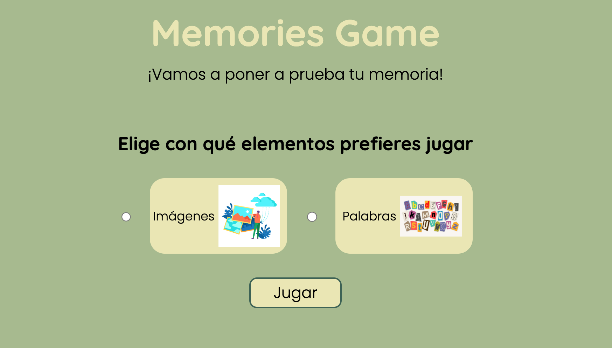

# MEMORIES GAME

This is my first project to evaluate my knowledge in HTML, CSS, and JS.

## Screenshot

## Demo
You can try the game by following this link: [Demo](https://crisher73.github.io/Memories-Game/)

## Features

- Choose to play with Images or Words.
- You will see 5 images or 5 words, and when you click on "Match," you must indicate the order in which they appeared on the screen.
- You have 15 seconds to make the matches.
- After validation, the game will indicate if you have a good memory or not. 

## Technologies Used

- HTML
- CSS
- JavaScript

## Installation

1. Clone the repository: git clone REPOSITORY_URL
2. Open the project in your code editor.
3. Open the `index.html` file in your browser.

## Usage

1. Open the `index.html` file in your browser.
2. Follow the instructions to play the game.

## Contribution

If you would like to contribute to this project, please follow these steps:

1. Fork the repository.
2. Create a new branch: `git checkout -b new-branch`
3. Make the changes and commit them: `git commit -m 'Description of the changes'`
4. Push the branch to your forked repository: `git push origin new-branch`
5. Create a pull request in the original repository.

## Autor

Cristina Hernández 

## Licencia

Este proyecto está bajo la [licencia MIT]. Puedes ver el archivo de licencia [aquí](https://opensource.org/license/mit/).

## Acknowledgments

I would like to thank [Alorse](https://github.com/Alorse) for challenging me to program and develop new skills.